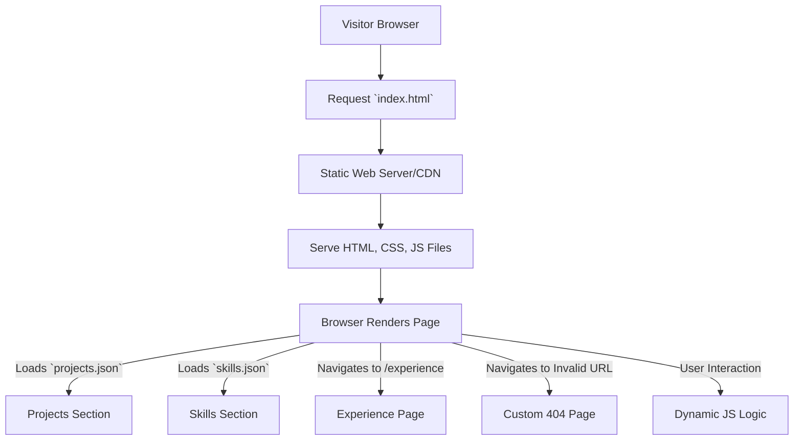

# 🚀 Dynamic Personal Portfolio Website

<p align="center"></p>

## Short Description
Showcasing expertise and achievements in an engaging, modern format, this project delivers a highly responsive and interactive personal portfolio website. It features dedicated sections for professional experience, project showcases, and a dynamic skills overview, all designed to captivate visitors and highlight a developer's journey and capabilities.

## ✨ Key Features
*   **Interactive User Interface:** A modern, visually appealing design with smooth transitions and animations powered by custom JavaScript and `particles.min.js` for an engaging visitor experience.
*   **Comprehensive Project Showcase:** A dedicated section dynamically loads project details from `projects.json`, offering a structured and easily updatable display of your work.
*   **Detailed Experience Timeline:** Navigate through professional experiences with a clear, engaging timeline layout, highlighting career milestones and contributions.
*   **Dynamic Skills Overview:** Presents your technical proficiencies, making it easy for recruiters and collaborators to understand your expertise.
*   **Integrated Resume Download:** Provides a direct link to your professional resume, simplifying the application and review process.
*   **Custom 404 Error Page:** Ensures a consistent brand experience even when users land on non-existent pages.
*   **Automated Deployment (CI/CD):** Leverages GitHub Actions for seamless continuous integration and deployment, ensuring the website is always up-to-date and accessible.

## Who is this for?
This portfolio website is ideal for:
*   **Software Developers & Engineers:** To present their skills, projects, and professional journey to potential employers.
*   **Freelancers & Consultants:** To showcase their capabilities and attract new clients.
*   **Students & Graduates:** To build an online presence and stand out in the job market.
*   **Anyone:** Looking for a professional, easily customizable platform to highlight their personal brand and work.

## Technology Stack & Architecture
*   **Frontend:** HTML5, CSS3 (with custom styles), JavaScript (Vanilla JS, `particles.min.js`).
*   **Data Storage:** JSON files (`projects.json`, `skills.json`) for dynamic content loading.
*   **Version Control:** Git & GitHub.
*   **Continuous Integration/Continuous Deployment (CI/CD):** GitHub Actions.
*   **Hosting:** Designed for static site hosting (e.g., GitHub Pages, Netlify, Vercel).

## 📊 Architecture & Database Schema
This project is a static website and does not utilize a traditional database. Its architecture is centered around client-side rendering of static content and dynamically loaded JSON data.



## ⚡ Quick Start Guide
To get this impressive portfolio website up and running locally:

1.  **Clone the Repository:**
    ```bash
    git clone https://github.com/shahajighadage1982-max/portfolio_website.git
    cd portfolio_website
    ```
2.  **Open in Browser:** Simply open the `index.html` file in your preferred web browser. All content will load directly.
    ```bash
    # For macOS/Linux users, you might use:
    open index.html 
    # For Windows users, you can double-click index.html or use:
    start index.html
    ```
3.  **Explore Other Sections:** Navigate to `experience/index.html` and `projects/index.html` to see the dedicated sections, or interact with the main page.

## 📜 License
This project is released under the [MIT License](./LICENSE).